Emojis are so integrated into our lives, that they have become a universal language. Instead of "yes", "kyllä", or "ja" we can simply use 👍 - and everybody understands it. Magic!  Let's explore how we can use Emojis in Power Platform.

<!--truncate-->

## Why? 🧐

Think about the apps you use every day. How would they look without any icons, just text buttons... Not great. Usage of icons signal common functions  across apps, making it easy to find functions and adopt new user interfaces (UI). Consider these universal conversions:

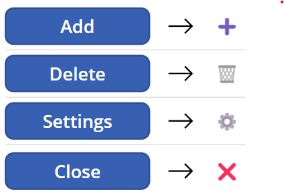

As you can see, text buttons look quite dull in comparison while using icons greatly improves the look and feel of your applications. Space is also much more effectively used with icons.

There's also consideration for multilingual applications. Using icons there is no need for translation - they mean the same in all languages. 

## Icons vs Emojis

:::warning Cross-Platform Emojis

Emojis are platform-aware. This means the emojis differ from platfrom to platform. It is not an advantage or disadvantage, just something to be aware off. You can find a reference from [Unicodes site](https://unicode.org/emoji/charts/full-emoji-list.html).

:::

As we're discussing icons and emojis in the context of Microsoft Power Platform it's a good idea to stop and think about the target audience of our solutions. Power Platform is generally used for inward facing apps for our own organization. Aren't Emojis too casual? 

I would argue that, no, emojis are not **too** casual. Using them in business context lightens the mood and makes apps look less stuffy and rigid. A little color from Emojis is welcome in many cases. They're used in our free time, so why not at work as well?

There is naturally such a thing as **too much**. Use emojis where needed and where it really makes sense. Don't try to have a whole conversation with emojis - or use only emoji buttons when its meaning is universal.

Consider also where you want to add icons, since Emojis and SVGs differ slightly on where you can put them. Emojis are more supported.

Whether you choose Emojis or Icons, be consistent. Mix and match rarely results in cohesive and nice look. 

## Where to find them?

:::info Open source

Be mindfull of licensing of Open Sourced resources. They may have restrictions for commercial usage.

:::

Emojis are found from your computers keyboard, with a shortcut. On Windows it's `🪟 Win + V` and  `🌐` on MacOS. 

For icons there are a lot of options. Regardless of the source, <!-- suosi --> vector images with `.svg` extension. I recommend these two:

- [FontAwesome](https://fontawesome.com/) 
- [Fluent 2](https://fluent2.microsoft.design/iconography) 

### Font Awesome

Font Awesome has a Free and Pro versions. SVGs already include needed attribution. To find and download icons follow these instructions:

1. Navigate to [Font Awesome](https://fontawesome.com/icons).
1. Search for icon, we'll search for `vehicle`.
1. Select the first icon found.
1. Download the icon as SVG.
   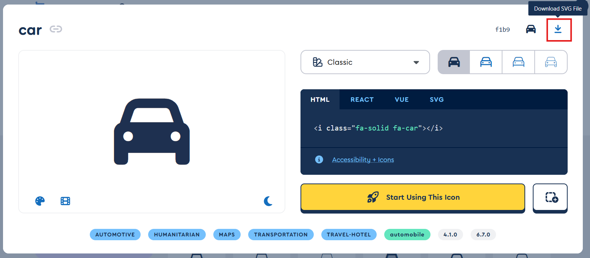

### Fluent 2

Fluent 2 is used and created by Microsoft. Resources are MIT lisenced. To find and download icons follow these instructions:

1. Navigate to [Fluent UI Icons repository in GitHub](https://github.com/microsoft/fluentui-system-icons).
1. Navigate to [assets folder](https://github.com/microsoft/fluentui-system-icons/tree/main/assets).
1. Select the icon, then `SVG folder`. <br />
   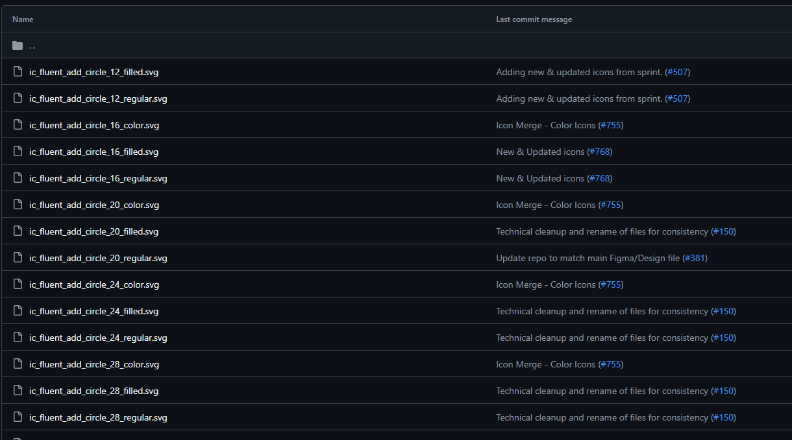
1. In the folder there are many versions and sizing options for the same icon. Here we have sizes:
   - 12
   - 16
   - 20
   - ...

   And versions:
   - filled
   - regular
   - color

   For our purposes size doesn't matter, vector images scale infinitely. Just select the version you want, to open the file on GitHub.
1. Download the icon. <br />
   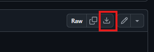

### Emoji as SVG

Icons are image files only. For Emojis we can use them _inline_ as text, but in many places we need an actual file to use. Creating one is easy:

1. Open your favorite code editor. Notepad on Windows can also be used.
1. Copy and paste this code snippet:
    ```html
    <svg viewBox="0 0 100 100" xmlns="http://www.w3.org/2000/svg">
        <text y="80" font-size="80">🙂</text>
    </svg>
    ```
1. Substitute the smiley with an Emoji of your choosing.
1. Save as `.svg` file.

## Create a web resource

Using icons outside of Canvas Power Apps requires the icon or Emoji SVG to be uploaded as web resources.

1. Navigate to your solution in [Power Apps Maker portal](https://make.powerapps.com/).
1. Select **New** -> **More** -> **Web resource** 
1. Upload your icon or emoji SVG. All fields get automatically populated. Edit if needed.
    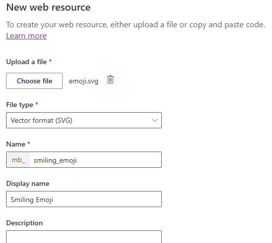
1. Select **Save**.

## Where to use icons or emojis

There are many opportunities to use icons in Power Platform!

### 🖥️ App icons 

:::info Power Apps Canvas

For Power Apps Canvas the app icon has to be in `.png` or `.jpg`. There is some image manipulation needed for this use case as well as icon / emoji lisencing considerations. This post will not go into that. 

:::

By default the Model-driven Power Apps' icon is _very_ dull. Adding an icon can help the user differentiate apps from each other when there are multiple in an environment.

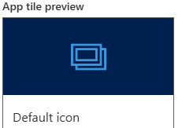

1. Open your Model-driven Power App in editor.
1. Select on **Settings** in the top menu.
1. In **General** settings select **Use web resource** as **Icon**.
1. Select **Select icon** and search and select [your uploaded icon](#create-a-web-resource). Select **Apply**.
    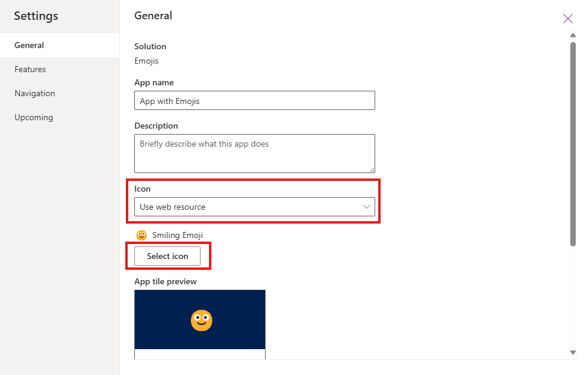
1. Close settings and select **Save and publish**.

Now your custom icon or emoji is you apps icon!

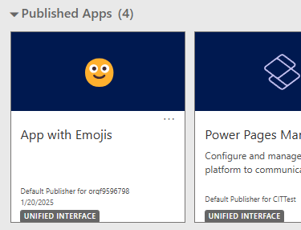

### 📁 Table icons 

All out-of-the-box Dataverse tables have an icon - but the default for custom tables is... Let's say lacking. 

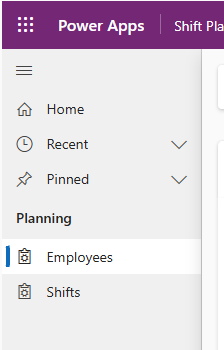

:::info Add icon for table

Best practice is to add the icon for the Dataverse table, although it is also possible to customize the icon in Model-driven Power App editor. On table scope all apps, that consume the table, will get the new icon.

:::

1. Open your table in the solution.
1. Select **Properties**.
1. Select **Advanced options**.
1. In **Choose table image** select your [icon web resource](#create-a-web-resource).
1. Select **Save**.

All Model-driven Power Apps will use the newly added icon.

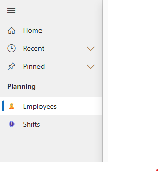

### ✏️ Canvas app 

#### Emoji

Adding Emojis in Canvas Power Apps is easiest **inline**.

1. Open your Canvas app in editor.
1. Select **Insert** and then **Button**.
1. For **Text** property write the Emoji. <br />
    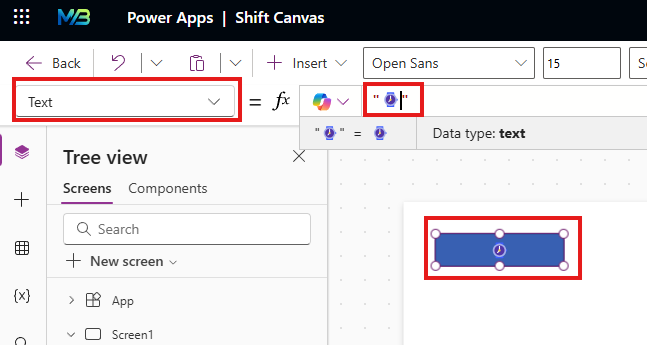
1. Customize your button further

#### Icon

Other icons can be added as **Media**.

1. Open your Canvas app in editor.
1. Open the **Media** panel. <br />
    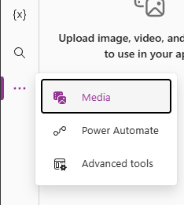
1. Select **Add media** and then **Upload**.
1. Select your icon file and select **Open**.
1. Select newly added image to add to canvas.

Now you have an icon added you your Canvas Power Apps. Note, that color or hover etc properties can't be modified in Power Apps Studio. There are ways around this - but that is a topic for another post.

### ✅ Choices

For choices Emojis can be used directly in the **label**. They're rendered in menus as well as views. SVGs can't be used with low-code - a PCF could work.

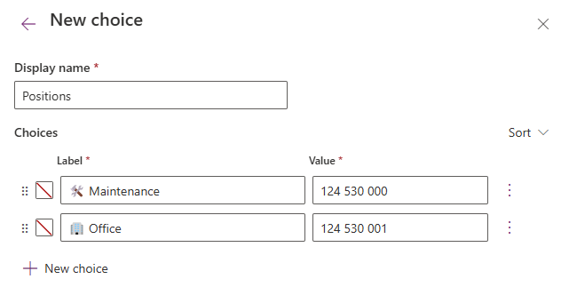

### 🔍 View names

In view names Emojis can be added by modifying the view name. SVGs can't be added at this time.

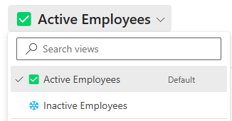

### 📄 Form names 

As in views, Emojis can be added to the form name.

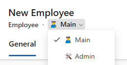

## Conclusion

In conclusion, incorporating emojis and icons into your Power Platform solutions can significantly enhance user experience and interface design. They provide a universal language that transcends linguistic barriers, making your applications more intuitive and engaging. 

While emojis add a touch of fun and familiarity, icons offer a clean and professional look. Remember to use them judiciously to maintain a balance between functionality and aesthetics. By following the guidelines and tips provided in this post, you can effectively leverage these visual elements to create more appealing and user-friendly Power Platform applications. 

Happy designing! 🎨🚀