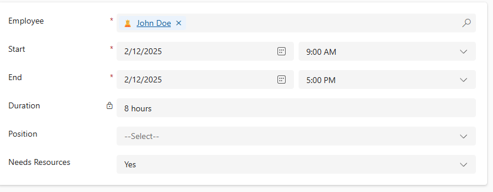

Model-Driven Power Apps enable makers to quickly create data focused applications. As the name suggests they lean on the data model in Dataverse. We can customize forms functionality with [business rules](https://learn.microsoft.com/en-us/power-apps/maker/data-platform/data-platform-create-business-rule) to automatically populate columns, show validation messages and control column visibility and requirement level. Business rules work in the scope of a column - what if we want to control other things on the form? Let’s dive into simple JavaScript functions every citizen developer should know!

<!-- truncate -->

## JavaSript 🤔

JavaScript is one of the three language of the web - it gives websites their functionality. In the context of Power Apps, we need it to control Model-Driven forms after business rules can’t accommodate our requirements. 

Business rules is the no-code option for creating custom functionality. They are easy to create and modify. Business rules should be your primary choice instead of JavaScript. Only when business rules can't do the task, should you look into JavaScript. The one caveat here is that you should not use business rules and JavaScript on the same form.  

## Business Rules vs JavaScript

|       | Business rule | JavaScript |
| ----- | :-----------: | :--------: |
| Full control over form | ⛔ | ✅ |
| Set column values | ✅[^1] | ✅ |
| Clear column values | ✅[^1] | ✅ |
| Set column requirement levels | ✅[^1] | ✅ |
| Show or hide columns | ✅[^1] | ✅ |
| Enable or disable columns | ✅[^1] | ✅ |
| Validate data and show error messages | ✅[^1] | ✅ |
| Create business recommendations based on business intelligence. | ✅[^1] | ✅ |
| Complex business logic | ⛔ | ✅ |
| Modify another tables rows | ⛔ | ✅ |
| Works outside a form | ✅[^2] | ⛔ |
[^1]: doesn’t support choices (multi-select), file or language datatypes
[^2]: Show or hide columns, enable or disable columns and business recommendations based on business intelligence action types only work in form context

While business rules are useful, pretty soon you’ll run into a case where you need more. This is where JavaScript, Client Side Scripting, comes in.

## Getting started

To get started with client side scripting there are three steps:

1. Write your script
1. Create a web resource
1. Register event handlers

My use case here is a model-driven Power App, where employee data and shifts are managed. We'll customize shift forms.

### Write your script

Writing JavaScript can seem daunting, if you have no prior programming experience. Don't worry, you can start off using copy-pasting and adding limited modifications. It is really that easy 😎! To write code, we generally use code editors, like [Visual Studio Code](https://code.visualstudio.com/). I highly recommend downloading it, as it helps in many places from displaying JSON from Power Automate to actually coding. 

#### Create namespace

Client side script files should be namespaced. Namespacing means that all functions have similar naming prefix or *namespace*. So instead of function being named `doSomething`, namespaced version is `company.namespace.doSomething`. Using them is a best practice in all your JavaScript resources. 

1. Open your prefered code editor
1. Create a new file and name it as you wish, with file extension `.js`. I'm naming mine `shiftFormScripts.js`.
1. Paste the following code into the editor:

```javascript
if (typeof (MB) === "undefined")
{var MB = {__namespace: true};}

MB.ShiftForm = {
    // Your functions go here
   __namespace: true
}
```

In this example `MB` is my company name and `ShiftForm` detailed namespace. Together they create our namespace `MB.ShiftForm`, where functions will be created.

#### Add a function

Starting off by something simple, we will only log `Hello World` into the browsers console. Add the highlited function to your file.

```javascript
if (typeof (MB) === "undefined")
{var MB = {__namespace: true};}

MB.ShiftForm = {

    // highlight-start
    handleOnLoad: function (executionContext) {
        "use strict";
        console.log('Hello world!');
    },
    // highlight-end

   __namespace: true
}
```

Save your file. We will upload it to our solution next.

### Create a web resource 

To use our script file, we first need to create a web resource. 

1. Navigate to your solution in [Power Apps Maker portal](https://make.powerapps.com/).
1. Select **New** -> **More** -> **Web resource** 
1. Upload your JS file. All fields get automatically populated. Edit the name to include the file extension. This is not mandatory, but it will help while debugging your scripts.
    
1. Select **Save**.

### Register event handlers

Now that we have a web resource we can put it in use. Next we register our event handlers. What are those, you might ask? Event handler registration tells model-driven app, that this event is handled by that function. There are quite a few events we could tap into, but we'll use **On Load** for now. Our app fires the event when a form is saved and then our registered handler will excecute the logic.

1. Navigate to your solution in [Power Apps Maker portal](https://make.powerapps.com/).
1. Open the form you want to register this code into. I'll register it into Shift table main form.
1. From the property pane, select **Events**. 
    
1. Select **Add library** and search for your web resource.
    
1. Select **Add**. Now we have associated our resource with the form. Next register the handler.
1. Expand the **On Load** section and select **+ Event Handler**
1. In **Function** write the namespaced name of your function. In my case it's `MB.ShiftForm.handleOnLoad`. 
1. Select **Pass excecution context as first parameter**.
1. Select **Done**.
1. Select **Save and publish**.
    

### Test it out!

Now we have created our script, web resource and registered our first event handler. Open your model-driven app and test it out.

1. Open your app
1. Open your browsers developer tools by pressing **F12** on your keyboard.
1. Open the console. <br/>
    
1. Clear it, so we can see our log message better, by pressing **CTRL + L** on your keyboard.
1. Create new record on the form. Now the form will load and we'll see our console message!<br/>
    

Now you know how to create and register client side scripting, awesome! Next I'll discuss most common use cases and how to implement them.

## Most common use cases 

### Show hide sections and tabs

While showing and hiding can be accomplished with Business Rules, they do not support hiding complete sections or tabs. In my opinion it's kind of a bummer, but with simple JavaScript we can do this. 

I have a simple form, which has two sections. I want to hide the resources section, when **Needs Resources** is set to **yes**. 


First I need a the name of my tab and the name of the **resources** section. **Name** property is used to access that specific element via JavaScript. My tabs name is `tab_general` and sections `section_resources`. These names are for you to define, **don't use what is generated for you** ⛔. The generated names are not very descriptive, so take a moment to name your components properly.

 

The code is very simple and I've commented it to explain further.

```js
hideResourceSection: function (executionContext) {
    "use strict";
    // Get FormContext from excecution context
    // Via FormContext you can access all properties in the form
    var formContext = executionContext.getFormContext();
    // Get the value of a field in my data, which has logical name mb_needsresources
    var needsResources = formContext.getAttribute("mb_needsresources").getValue();
    // Get the tab where your section lies with tabs name
    var tab = formContext.ui.tabs.get("tab_general");
    // Get the section which you want to hide or show
    var section = tab.sections.get("section_resources");
    // If mb_needsresources is set to true, set section visible as true
    // otherwise, set section visible as false
    if (needsResources) {
        // Set visibility
        section.setVisible(true);
    } else {
        section.setVisible(false);
    }
},
```

Register this code in two places, On Load of the form **and** On Change of field `mb_needsresources`. These two are needed, because you need to set visibility in initial load of the form as well as when the field is changed. 


Controlling the visibility of the tab is even easier, just use `.setVisible` directly for the `tab` object.

### Calculate column value in real time

Calculated columns are an awesome feature of Dataverse to create logic and calculationa directly in the datadase. There is an issue though - the columns are calculated on retriaval, not in unsaved model-driven form. Let's fix that.

I've added a duration field to my form. Its value is calculated based on start and end date times. How ever, it is not calculated as the values change prior to saving. 



We can remedy this by creating a script, that calculates and sets duration whenever either start or end field changes. Let's see the code.

```js
calculateDuration: function (executionContext) {
    "use strict";
    // Get FormContext from excecution context
    var formContext = executionContext.getFormContext();
    // Get start time field value
    var startTime = formContext.getAttribute("mb_start").getValue();
    // Get end time field value
    var endTime = formContext.getAttribute("mb_end").getValue();
    // If we hace both
    if (startTime && endTime) {
        // Calculate the duration
        // JavaScirpt returns milliseconds, so here we convert them into minutes
        var duration = (endTime - startTime) / (1000 * 60);
        // Set the duration value 
        formContext.getAttribute("mb_duration").setValue(duration);
    }
},
```

Last thing to do is to register event handlers. I've registered **On Change** event handlers for mb_start and mb_end. As you can see with just a few lines of code we can create this awesome functionality.


### Set notifications

Notifications are messages we can show the user on the form, field or even the whole app context. Here, I'm going to add notification to the form to indicate that the shift is in the past. 

```js
showNotification: function (executionContext) {
    "use strict";
    // Get FormContext from excecution context
    var formContext = executionContext.getFormContext();
    // Get mb_end 
    var endTime = formContext.getAttribute("mb_end").getValue();
    // Compare end to current dateTime
    if(endTime < new Date()){
        // If endtime is less than right now, show notification on form
        formContext.ui.setFormNotification("This shift is in the past", "INFO", "1");
    }
},
```

This code is registered as event handler to the **On Load** event of the form, so it will run every time the form is loaded.


## Conclusion

In conclusion, JavaScript is a powerful tool that can significantly enhance the functionality of your Model-Driven Power Apps. While business rules provide a no-code solution for many scenarios, JavaScript allows for more complex and customized behaviors that business rules cannot achieve! By understanding how to write scripts, create web resources, and register event handlers, you can take full control over your forms and provide a better user experience. 