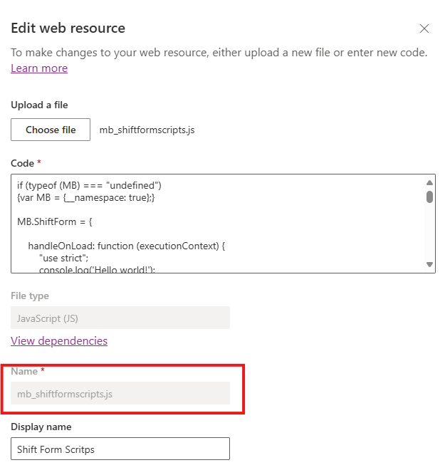
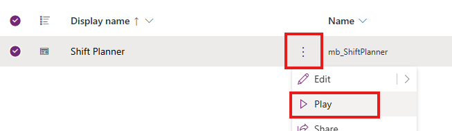
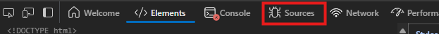
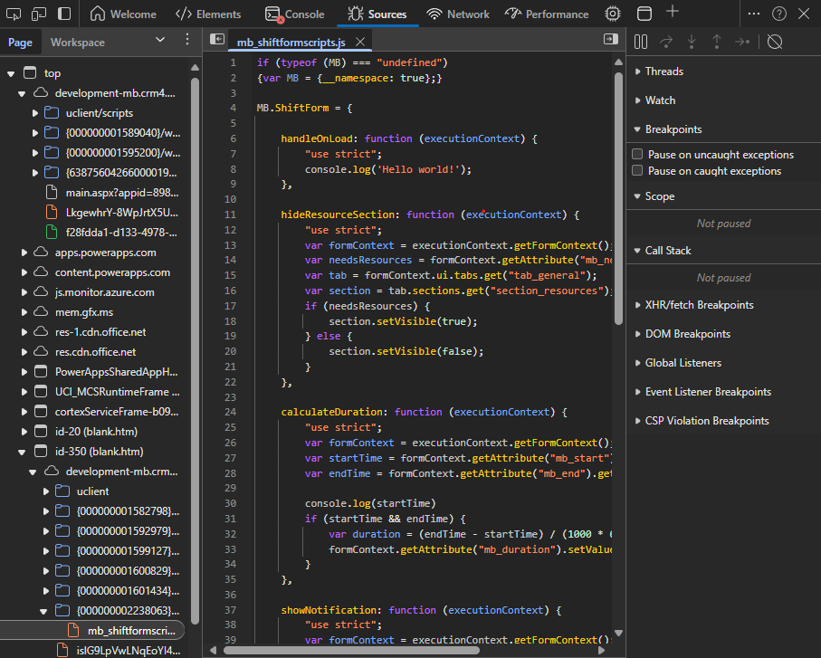
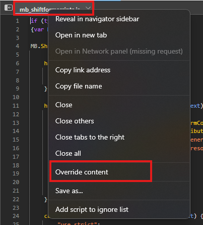
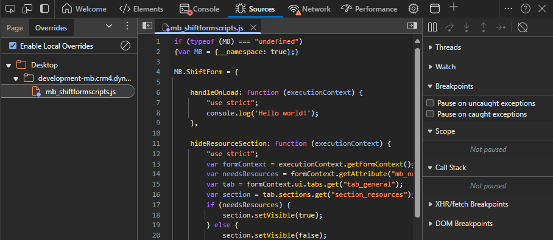
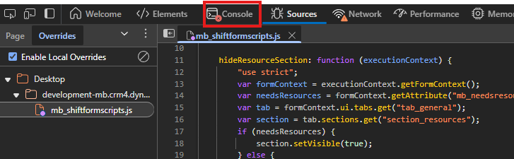
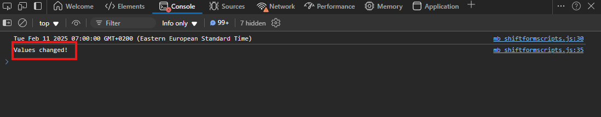
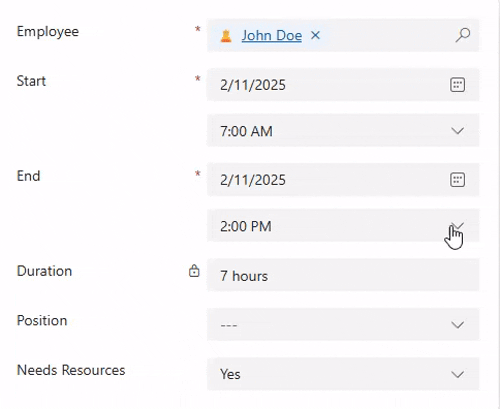

Development of client side scripting can be painful. As discussed in my [previous blog post](../02-12-must-know-javascript-in-model-driven-apps/index.md) it is very easy to get started, but the flow - `coding ➡️ uploading ➡️ publishing ➡️ refresing` - is very time consuming and super annoying.

Microsoft describes [how to use Telerik Fiddler](https://learn.microsoft.com/en-us/power-apps/developer/model-driven-apps/streamline-javascript-development-fiddler-autoresponder) to help with this. As a Mac user, my issue with that is, that Fiddler Classic is not available for MacOS. [Fiddler Ewerywhere](https://www.telerik.com/fiddler/fiddler-everywhere) is available for MacOS as well, but it's not free. 

The free and better option are browser developer tools 🌟. Let's next discuss on how to streamline your development flow with them!

<!-- truncate -->

## Browser developer tools

Browser developer tools are a set of built-in utilities in modern web browsers, that help developers inspect and debug web pages. They provide features like HTML and CSS inspection, JavaScript debugging, network activity monitoring, and performance analysis, making it easier to develop and troubleshoot web applications. 

But wait, we're talking about Power Apps? It might not be obvious from designing to deploying Power Apps, but they are fundamentally web pages. Microsoft makes developing them easy with different editors, but the code behind your apps is still good old HTML, CSS and JavaScript.

Back to the tools. Every modern browser has built-in developer tools. They might be called a bit differently between vendors, but the functionality is generally the same. They are an essential tool in your Power Platform toolbox. I'll use Microsoft Edge in the examples, but Google Chrome works pretty much the same. Here we'll dive into JavaScript debugging.

## Let's code

:::note Prerequisites

- Model-Driven Power App
- JavaScript web resource
- Registered event handlers

:::

### Grab the name of the web resource

I'm going to use my previous example of Client Scripting. To start, you need to find the **Name** of the web resource you want to continue to develop.

1. Go to your solution with the app and web resource.
1. Open the edit panel of the web resource.
1. Copy the **Name** property.
   

### Override the resource

:::info

I'm, using Microsoft Edge, but Google Chrome and others work very similarly.

:::

To enable us to continuosly develop and test our code, we need to override the web resource in the browser.

1. Play your model-driven Power App.
   
1. Navigate tho the form where you use JavaScript.
1. Press **F12** on your keybord. Developer tools open next to the webpage.
1. Select **Sources**
   
1. Press **Ctrl + P** and search with the **Name** of your web resource and press enter. You should now have your script file open in Developer tools.
   
1. Right click on the file tab and select **Override content**.
   
1. Developer tools will prompt you to select a folder to store override files in. Select **Select folder** and choose a location. I'll select Desktop.
1. The browser requests access to that location, select **Allow**.
   

Your file is now overridden. This means that instead of fetching the web resource from Dataverse, the browser injects it from your local machine. The app itself works just as before, but now we are able to modify the code without complicated updates.

:::info

Keep the developer tools open, otherwise the override will stop working if you refresh the page or navigate elsewhere.

:::

### Write some code

You can start modifying your JavaScript directly from developer tools, or you can use your preferred code editor. I'll use Visual Studio Code.

Open the file from your desktop. You can find it inside one of the folders. The developer tools creates similar file system structure as in the web page, so this is why there are subfolders.

My code here automatically updates the duration field when the start and end fields are modified. You can find a detailed description of the functionality [here](../02-12-must-know-javascript-in-model-driven-apps/index.md#calculate-column-value-in-real-time).

For now I'll update the code to log a message into the console so we can check out, if it works.

1. Update the function.
    ```js
    calculateDuration: function (executionContext) {
      "use strict";
      var formContext = executionContext.getFormContext();
      var startTime = formContext.getAttribute("mb_start").getValue();
      var endTime = formContext.getAttribute("mb_end").getValue();

      console.log(startTime)
      if (startTime && endTime) {
         var duration = (endTime - startTime) / (1000 * 60);
         formContext.getAttribute("mb_duration").setValue(duration);

         // highlight-start
         // Log something on the console when values change
         console.log("Values changed!");
         // highlight-end
      }
    },
    ```
1. Save the file.
1. Select **Console** back in developer tools.
    
1. Press **Ctrl + L** on your keyboard to clear the console.
1. Trigger your code. In my case I'll change the start time, which will run the code.
    

Notice that we did not update the Power App tab at any point. The modified script will be called as if it was uploaded to your solution. Just for the sake of it, I'll add some code to show a recommendation message below the duration, when the value is over 8 hours. Here is the final result:

```js

calculateDuration: function (executionContext) {
   "use strict";
   var formContext = executionContext.getFormContext();
   var startTime = formContext.getAttribute("mb_start").getValue();
   var endTime = formContext.getAttribute("mb_end").getValue();
   
   console.log(startTime)
   if (startTime && endTime) {
      var duration = (endTime - startTime) / (1000 * 60);
      // highlight-start 
      var durationControl = formContext.getControl("mb_duration");
      // highlight-end
      formContext.getAttribute("mb_duration").setValue(duration);
      // highlight-start
      if (duration > 480) {
            durationControl.addNotification({messages: ["Avoid over 8 hour shifts."], notificationLevel: "RECOMMENDATION", uniqueId: "2"});
      } else {
            durationControl.clearNotification("2");
      }
      // highlight-end
   }
},

```



### Update the web resource

Pretty cool, right? After you are done locally developing your scripts and want to move your progress to production use, **remember to update the webresource in your solution**. I can tell you, I've forgotten this crucial step so many times and wondered why my awesome scripts have stopped working... Oh well, maybe someday I remember  😅.  

## Conclusion

Using browser developer tools to override web resources can significantly streamline your development workflow. This approach eliminates the need for repetitive uploading and publishing, allowing you to see changes in real-time. By leveraging developer tools in your browser, you can enhance your productivity and focus more on coding rather than managing updates. This method is particularly useful for Power Platform developers looking to optimize their development flow 🤖.