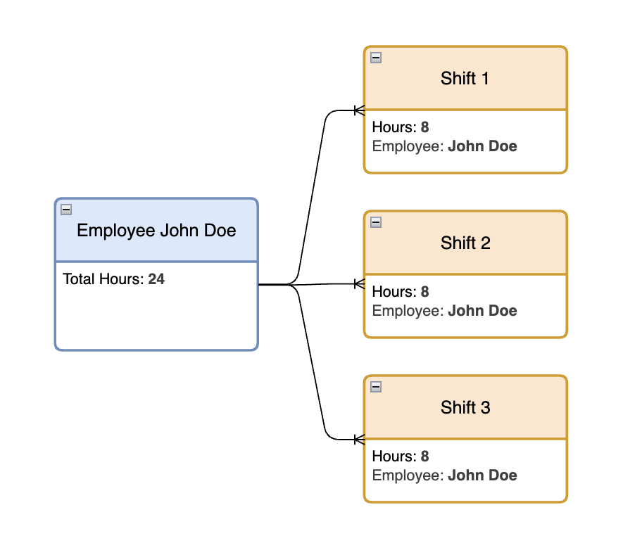
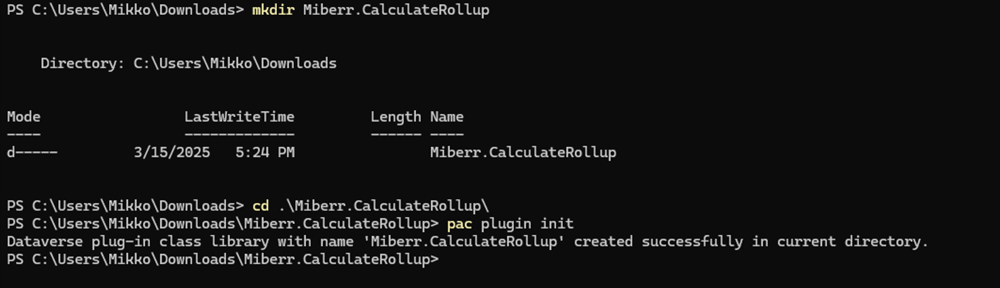
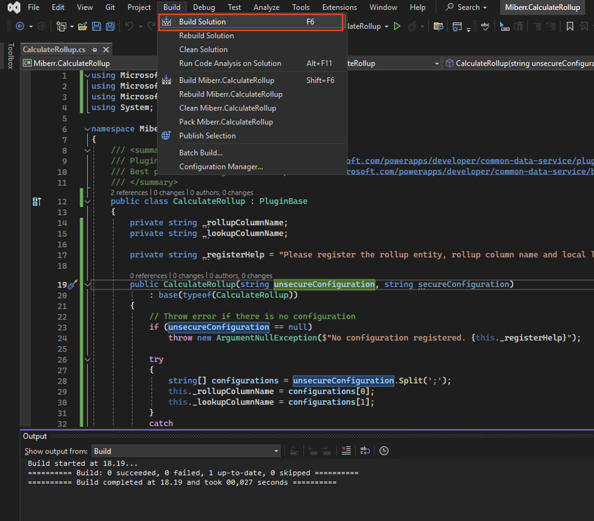
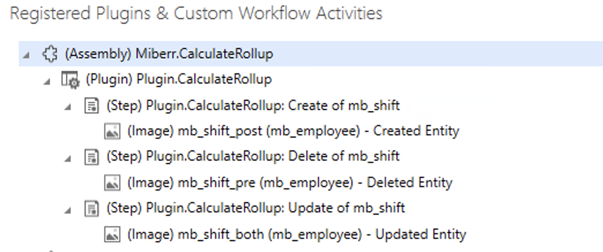
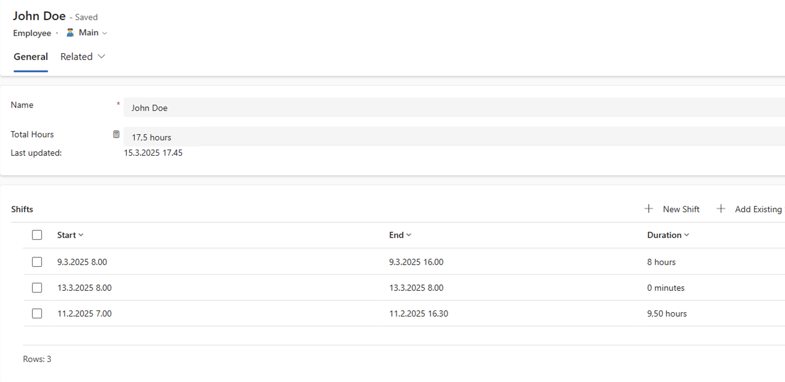
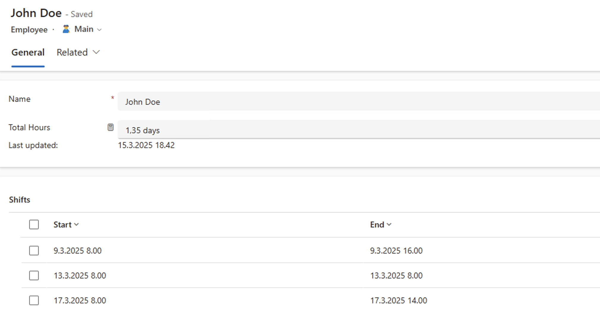

Dataverse is a highly capable and extensible database platform that offers multiple ways to implement business logic and automation. In this post, we'll dive into Dataverse plugins, which are the most performant method for creating complex logic within Dataverse. We'll explore how to create a reusable plugin that calculates rollup fields in real time ⏰.

<!-- truncate -->

## Logic in Dataverse

There are multiple ways to create business logic and automation when it comes to Dataverse:

-   [business rules](https://learn.microsoft.com/en-us/power-apps/maker/data-platform/data-platform-create-business-rule)
-   [(classic) workflows](https://learn.microsoft.com/en-us/power-automate/workflow-processes)
-   [calculated columns](https://learn.microsoft.com/en-us/power-apps/developer/data-platform/calculated-rollup-attributes)
-   [low-code plugins](https://learn.microsoft.com/en-us/power-apps/maker/data-platform/low-code-plug-ins?tabs=instant)
-   [functions](https://learn.microsoft.com/en-us/power-apps/maker/data-platform/functions-overview)
-   [plugins](https://learn.microsoft.com/en-us/power-apps/developer/data-platform/plug-ins)
-   [Power Automate](https://learn.microsoft.com/en-us/power-automate/dataverse/overview)

:::info preview
Functions and low-code plugins are currently in Preview and as such shouldn't be used in production scenarios. For this post I'll foccus on production ready functionalities.
:::

To create complex logic options are limited (for now) to plugins, workflows and Power Automate.

|                          |            Plugin (C#)            |        Workflow (Classic)         |                         Power Automate                         |
| ------------------------ | :-------------------------------: | :-------------------------------: | :------------------------------------------------------------: |
| **Synchronous**          |                ✅                 |                ✅                 |                              ⛔️                               |
| **Asycronous**           |                ✅                 |                ✅                 |                               ✅                               |
| **Access External Data** |                ✅                 |                ⛔️                |                               ✅                               |
| **Low/no-code**          |                ⛔️                |                ✅                 |                               ✅                               |
| **Run On Demand**        |                ✅                 |                ✅                 |                               ✅                               |
| **Excecution stage**     |           Before/After            |           Before/After            |                             After                              |
| **Triggers**             | All Dataverse messages, On Demand | Create, Modify, Assign, On Demand | Create, Modify, Assign, Delete, Action Is Performed, On Demand |

In regards to performance, plugins are the most performant way to create logic in Dataverse.

## The problem

:::danger use sparingly
You should not use this calculation for every rollup you have. Calculations can be intesive and affect the performance of Dataverse as well as user experience of your applications. Use this only when realtime (or near real time) calculation is absolutely needed.
:::

In this post I'm going to address the issue with rollup columns - they don't calculate in real time or even close. Rollups are calculated hourly and then the result of the calculation is written to Dataverse. This is great since the calculations can be very intensive and take a while, but what if we really need the values calculated right away? This can be accomplished in multiple ways, but here we'll create a plugin.

In my case I have a shift planner app, that has employee that can have multiple shifts. Employee has a rollup that calculates the duration of all the shifts together.



I want that the total hours are calculated each time a new shift is either added or modified.

## Creating the plugin

### What are plugins

Dataverse plugins are custom business logic written in C# that can be executed in response to specific events within the Dataverse environment. These plugins are essentially class libraries which are compiled into assemblies and then registered with Dataverse. Once registered, they can be triggered by various Dataverse events such as create, update, delete, and more. Plugins provide a powerful way to extend the functionality of Dataverse by allowing developers to implement complex logic that runs synchronously or asynchronously, depending on the requirements.

### Let's code!

I'm going to crete a plugin that calculates a rollup field when related entity is crated. This is reusable and can be used in any table.

The easiest way to start creating is by using [Power Platform CLI](https://learn.microsoft.com/en-us/power-platform/developer/cli/introduction?tabs=windows), or PAC. Install PAC and create a folder in your chosen location. I'm going to call it `Miber.CalculateRollup`. The dot is there as namespacing. Run the following command in the terminal.

```bash
pac plugin init
```

With that PAC creates scaffoling for a plugin in the current folder. PAC uses the name of the folder as the name of the plugin project. Don't worry, it can be changed later if you made an mistake naming the folder.



Open the folder in your chosen code editor. I'm using [Visual Studio 2022](https://visualstudio.microsoft.com/downloads/) for development.

There are two C# files, but only one we need to worry about, the **Plugin1.cs**. **PluginBase.cs** includes some boilerplate code to ease our way and let us focus on creating the plugin logic. Rename **Plugin1.cs** as `CalculateRollup.cs` and make sure to rename the class itself as well.

The **ExecuteDataversePlugin** method is the entrypoint for our plugin. Replace the method with the following: _(I've commented the code to further explain which part does what.)_

```csharp
    // Entry point for custom business logic execution
    protected override void ExecuteDataversePlugin(ILocalPluginContext localPluginContext)
    {
        try
        {
            if (localPluginContext == null)
            {
                throw new ArgumentNullException(nameof(localPluginContext));
            }

            var context = localPluginContext.PluginExecutionContext;

            // Switch on message name
            switch (context.MessageName)
            {
                case "Create":
                    RecalculateRollup(GetEntityImage(context.PostEntityImages), localPluginContext);
                    break;

                // For update calculate both pre and post images
                case "Update":
                    RecalculateRollup(GetEntityImage(context.PreEntityImages), localPluginContext);
                    RecalculateRollup(GetEntityImage(context.PostEntityImages), localPluginContext);
                    break;

                case "Delete":

                    RecalculateRollup(GetEntityImage(context.PreEntityImages), localPluginContext);
                    break;

                default:
                    throw new ArgumentOutOfRangeException($"Message of type {localPluginContext.PluginExecutionContext.MessageName} is not supported by this plugin.");
            }

        }
        catch (Exception ex)
        {
            // Log the exeption
            localPluginContext.Trace($"Exception: {ex.ToString()}");
        }
    }

    // Helper method to get the entity image
    private Entity GetEntityImage(EntityImageCollection imageCollection)
    {
        if (imageCollection.Count > 0)
            return imageCollection.Values.First();
        else
            throw new ArgumentNullException($"No entity image found. Register image depending on message. Create: Post, Update: Pre and Post, Delete: Pre.");
    }

    // Helper method to actually do the calculation
    private void RecalculateRollup(Entity entity, ILocalPluginContext localPluginContext)
    {
        // Get the orgService to call Dataverse
        var orgService = localPluginContext.InitiatingUserService;

        // Check if lookup has value
        if (entity.TryGetAttributeValue(this._lookupColumnName, out EntityReference entityReference))
        {
            localPluginContext.Trace($"Trying to calculate rollup {this._rollupColumnName} for {entityReference.LogicalName} {entityReference.Id}.");

            // Create request
            CalculateRollupFieldRequest request = new CalculateRollupFieldRequest();
            request.FieldName = this._rollupColumnName;
            request.Target = entityReference;

            // Send request
            orgService.Execute(request);

            localPluginContext.Trace($"Rollup {this._rollupColumnName} for {entityReference.LogicalName} {entityReference.Id} was successfully recalculated.");
        }
        else
        {
            // Check if field exists
            RetrieveAttributeRequest retrieveAttributeRequest = new RetrieveAttributeRequest
            {
                EntityLogicalName = entity.LogicalName,
                LogicalName = this._lookupColumnName
            };

            RetrieveAttributeResponse retrieveAttributeResponse = (RetrieveAttributeResponse)orgService.Execute(retrieveAttributeRequest);

            // If no error was thrown, check the type is lookup
            if (retrieveAttributeResponse.AttributeMetadata.AttributeType == Microsoft.Xrm.Sdk.Metadata.AttributeTypeCode.Lookup)
            {
                localPluginContext.Trace($"Lookup {this._lookupColumnName} for {entity.LogicalName} {entity.Id} is empty and no calculation was triggered.");
            }
            else
            {
                throw new ArgumentException($"Column {this._lookupColumnName} for {entity.LogicalName} is not of type Lookup.");
            }
        }
    }
}
```

This code will calculate a rollup column based on triggering entitys lookup and given rollup. There's also quite a bit of validation and errors thrown for ease of use. Now we'll make this reusable.

### Reusable plugins

When ever we can, we should create code and other components as reusable. This way we don't have to repeat ourself each time we want to create the same functionality. In plugins, we can pass configurations for each step registered.

For calculating a rollup we need three things.

1. The row ID of the row in which the rollup column should be calculated
1. The logical name of the rollup column
1. The logical name of the entity that has the rollup

In this case we register the plugin to the N side of our target rollups 1:N relationship. From **excecution context** we get what was the triggering row, but we still need the lookup and the name of the rollup. These can be passed as configuration to the plugin.

To handle our configuration this code creates class properties for the configurations **rollupColumnName** and **lookupColumnName**.
Replace the constructor method with the following:

```csharp
private string _rollupColumnName;
private string _lookupColumnName;

private readonly string _registerHelp = "Please register the rollup entity, rollup column name and local lookup column name into unsecure configuration with format rollupColumnName;lookupColumnName.";

public CalculateRollup(string unsecureConfiguration, string secureConfiguration)
    : base(typeof(CalculateRollup))
{
    // Throw error if there is no configuration
    if (unsecureConfiguration == null)
        throw new ArgumentNullException($"No configuration registered. {this._registerHelp}");

    try
    {
        string[] configurations = unsecureConfiguration.Split(';');
        this._rollupColumnName = configurations[0];
        this._lookupColumnName = configurations[1];
    }
    catch
    {
        throw new ArgumentException($"Argument formatting in correct. {this._registerHelp}");
    }

}
```

## Build and register the plugin

Now that the coding is done, we need to build our plugin. Depending on the IDE of your choice, this varies. In Visual Studio 2022 click on **Build** and then **Build Solution**



Next we register the assembly and the steps.

1. Open your terminal again and run the following command:
    ```bash
    pac tool prt
    ```
1. This will open Plugin Registration Tool. Connect to your environment by selecting **Create new connection**. To select the environment don't forget to check **display list of available organizations**
1. Login with your user
1. After the environment loads, select **Register** and **Register New Assembly**
1. Select the assembly file, which can be found in `<YOUR_PROJECT_FOLDER>\bin\Debug\net462\Miberr.CalculateRollup.dll`.
1. Select **Register Selected Plugins**

Next let's register the steps. Step is like a trigger, to which event should the plugin react to.

:::warning consider asynchronous registration
By default plugin steps are registered as synchronous, meaning the triggering user has to wait for the code to run. Asynchronous option excecutes the code behind the scenes without the user having to wait. This might result in a small delay in the value updating.
:::

1. Select the plugin and then **Register** and **Register New Step**
1. Set **Message** as `Create`
1. Set **Primary Entity** as `mb_shift`
1. For **Event Pipeline Stage Of Excecution** select **PostOperation**
1. For **Unsecure Configuration** add the configuration string `mb_totalhours;mb_employee`. Here **mb_totalhours** is the rollup and **mb_employee** the lookup column names separated by a semicolon.
1. Select **Register New Step**

For the plugin to access the value in the lookup column, next we'll add an image to pass that.

:::note about entity images
The plugin will get some columns without an image, but it's good practice to include them anyway. For example for **Update** message only the updated fields are available by default without an image. Delete is even more restrictive, only the id is available without an image.
:::

1. Select the newly registered step
1. Select **Register** and then **Register New Image**
1. Check **Post Image**
1. Set **Name** and **Entity Alias** as `mb_shift_post`
1. For **Parameters** select the lookup column

Now we've registered our plugin, step and image to react when a shift is created. For complete solution we need to add the following:

| Message | Filtering attributes | Pre Image | Post Image |  Image Name   |
| ------- | -------------------- | :-------: | :--------: | :-----------: |
| Update  | The lookup only      |    ✅     |     ✅     | mb_shift_both |
| Delete  |                      |    ✅     |            | mb_shift_pre  |

Here's the end result below. It's finally time to test!



## Let's test it

Before any changes we can see that John has 17,5 hours worth of shifts.



I'll add another shift and what do you know, it does the calculation immidiately. That's pretty cool, isn't it?



## Conclusion

In this post, we explored how to create a reusable plugin in Dataverse to calculate rollup fields in real time. By leveraging the power of Dataverse plugins, we can ensure that our business logic is executed efficiently and reliably. We walked through the process of setting up the plugin project, writing the necessary code, and registering the plugin with Dataverse. This approach not only solves the problem of delayed rollup calculations but also provides a reusable solution that can be applied to various scenarios. With this knowledge, you can now create more complex and performant business logic in your Dataverse environment.

For added benefit for you, I've also created a [repository in GitHub](https://github.com/miberr/Dataverse-Plugin-Calculate-Rollup) from which you can download this plugin for your use cases. I'll also make some fixes if needed to this repository. Thanks for reading 🙏🏻 and until next time 😊!
