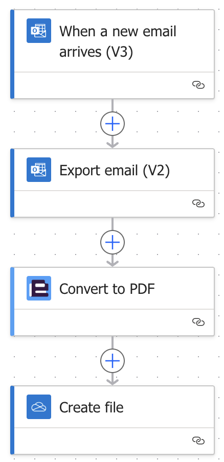
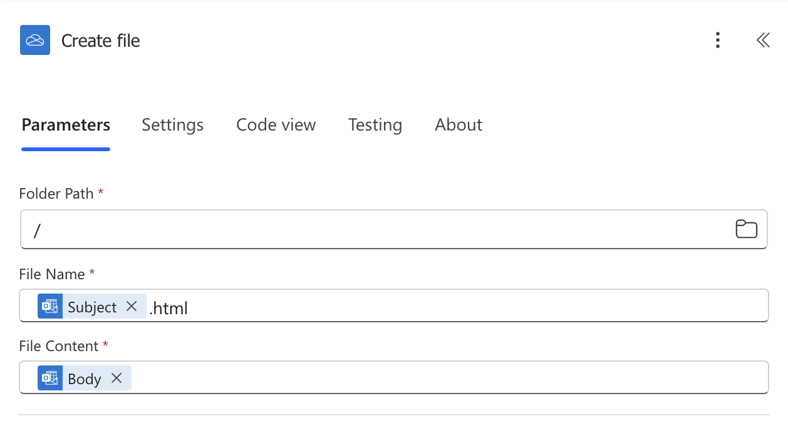
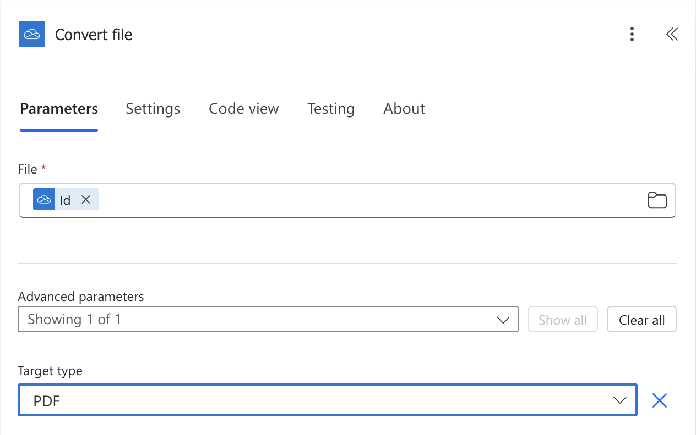
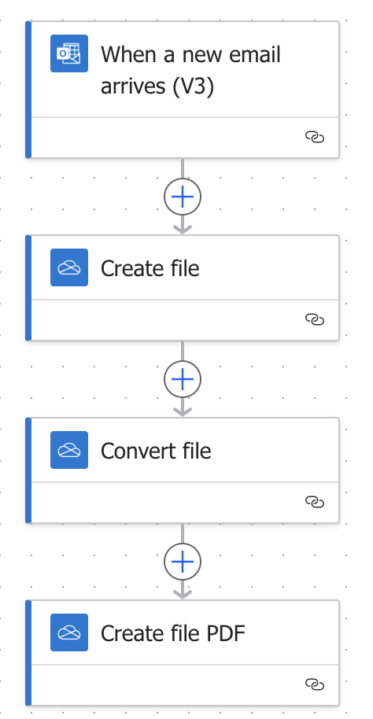
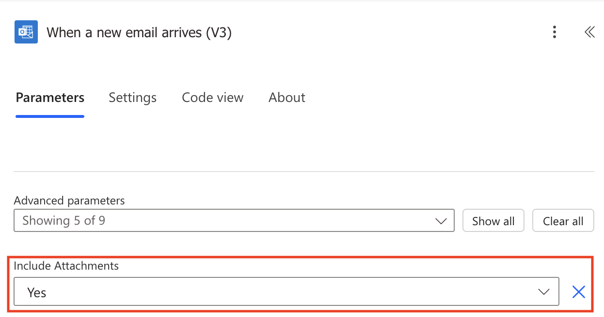
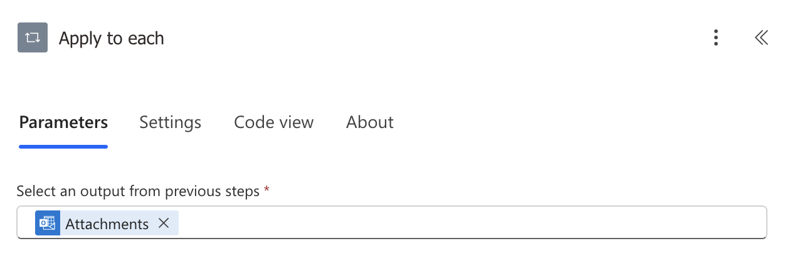
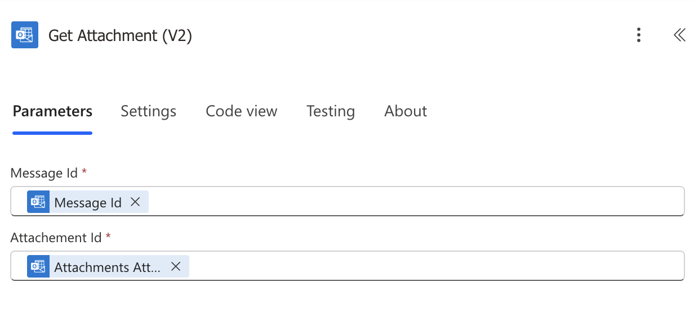
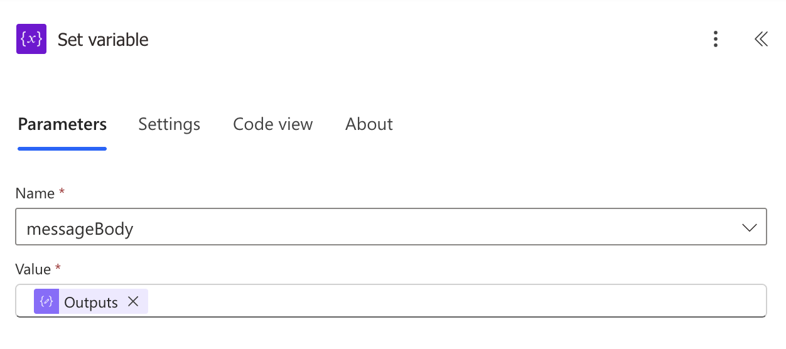
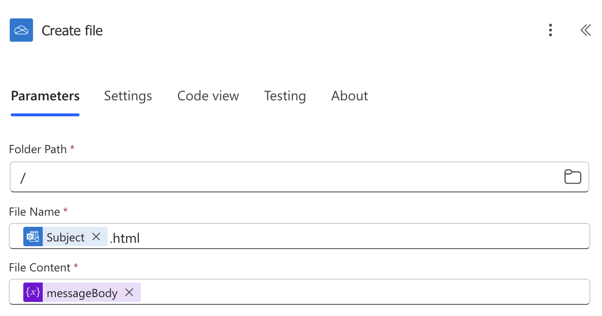
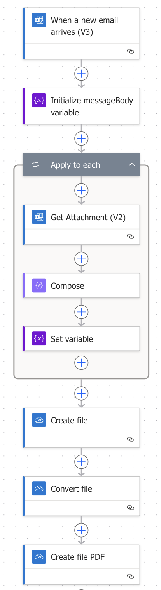

Let's be honest, nobody likes to deal with emails. Most of the time they're a necessary evil 😈 midst all modern communication channel options. Then the need arises - how to create a PDF automatically from a given email? That's what we'll discover in this blog.

<!-- truncate -->

## Options

Power Automate would be the obvious technology choice for this one. But what connectors? There are a two of options we'll take a look of.

Firstly there is [Encodian's Flowr](https://www.encodian.com/product/flowr/). This is an awesome service that helps with 200+ actions ranging from file type conversions to OCR from files. The service is has a free subscription with 50 credits per month to get you started. We can use Flowr to convert an email directly to PDF very easily.

Another way to do this is using Microsoft services only, but that comes with a challenge. There is no completely working convertion tool at least now - luckily we can get around this.

### Encodian Flowr

This connector makes it easy for us to do this. Here are the steps your Power Automate flow needs to have to convert to PDF.

1. Trigger your flow to respond to incoming email
1. Export that email with Outlook connector
1. Pass the exported content to Encodian
1. Save the resulting file

The flow would look something like this:



And the result:


That was easy. With a couple of steps we can convert an email into PDF. For more information about this option, visit [Encodians Blog](https://www.encodian.com/blog/converting-emails-and-attachments-to-pdf-in-power-automate/).

### DIY

Next, let's embark on a do it yourself 🪛 journey. As you might know, emails are sent as HTML in modern settings. We can leverage this as well as OneDrive connectors Convert to PDF action. This approach is not perfect, but one thing at a time. The flow is pretty similar:

1. Trigger your flow to respond to incoming email.

1. Save to OneDrive as HTML file.

    

1. Convert the file content to PDF with OneDrive connector.

    

1. Save to OneDrive as PDF.

    

Completed automation looks like so:



:::note
You can use SharePoint connector as well for saving the file. SharePoint connector doesn't have this conversion action and the HTML needs to be saved to OneDrive.
:::

Here are the results:


Yeah... That's not great now is it? 🥺 The images are not there, because the images were not included in the HTML file we saved. The message body also does not include the information about the message itself inside of it.

## Enhance your DIY flow

So there is room for improvement. Next I'm describing how to get the images into the PDF and getting the message metadata included as well.

### Show images

Let's start with the images. For this we have to first access the image file, get the base64 version of it and then embed it instead of the link in the HTML. There can be 0, 1 or N images included in an email. The image tags in the emails HTML looks like the example below ⬇️.

<!-- prettier-ignore -->
```html

    src="cid:40fabbc1-1dd6-48e0-a217-e90546ac2e18" 
    style="width: 271px; height:
    71px; max-width: 1049px" 
/>
```

We can use this to replace the `cid:40fabbc1-1dd6-48e0-a217-e90546ac2e18` with base64 representation of the image. So we'll need a variable to keep track of the HTML, loop trough the attachments and insert the images data directly into the HTML. Note that this approach will also go trough attachments that are not inline but no changes to the code will occure in that case.

Let's work this trough.

1.  Include the attachments in the trigger.

    

1.  Initialize a **string type** variable with email body as initial value. Put this action right after the trigger.

    

1.  Add a **Apply to each** loop with **Attachments** from the trigger as input.

    

1.  Inside the loop, add **Get Attachment (V2)** action from **Outlook** connector.

    

1.  Add a **Compose** action with the following expression as input.

    ```js title="Copy this"
    replace(variables('messageBody'),concat('cid:',outputs('Get_Attachment_(V2)')?['body/contentId']),concat('data:',outputs('Get_Attachment_(V2)')?['body/contentType'],';base64, ', outputs('Get_Attachment_(V2)')?['body/contentBytes']))
    ```

    ```js title="Formated for readability"
    replace(
        variables('messageBody'),
        concat(
            'cid:',
            outputs('Get_Attachment_(V2)')?['body/contentId']
        ),
        concat(
            'data:',
            outputs('Get_Attachment_(V2)')?['body/contentType'],
            ';base64, ',
            outputs('Get_Attachment_(V2)')?['body/contentBytes']
        )
    )
    ```

1.  Add a \_\*Set variable** action with the outputs from **Compose** as **Value\*\*

    

:::info Tip 💡

The combination of **Compose** and **Set variable** is how you can use variable and set it inside a loop. You can't use only **set variable** action alone.

:::

1. In the previously created **Create file**, replace **File Content** with the variable.

    

1. Your flow should now look like this.

    

### Add email information to the top
