Let's be honest, nobody likes to deal with emails. Most of the time they're a necessary evil 😈 midst all modern communication channel options. Then a need arises - how to create a PDF automatically from a given email? That's what we'll discover in this blog.

<!-- truncate -->

## Options

Either Power Automate or Azure Logic Apps would be the obvious technology choice for this one. But what connectors? There are two options we'll take a look at.

First there is [Encodians Flowr](https://www.encodian.com/product/flowr/). This is an awesome service that helps with 200+ actions ranging from file type conversions to OCR from files. The service has a free subscription with 50 credits per month to get you started. We can use Flowr to convert an email directly to PDF very easily.

Another way would be doing it ourselves with code. There are no built-in services that accomplish this without limitations.

### Encodian Flowr

This connector makes it easy for us to do the conversion. Here are the steps your Power Automate flow needs to have to convert an email to PDF.

1. Trigger your flow to respond to incoming email
1. Export that email with Outlook connector
1. Pass the exported content to Encodian
1. Save the resulting file

The flow would look something like this:

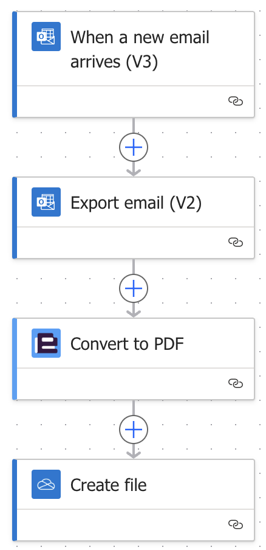

And the result:


That was easy. With a couple of steps we can convert an email into PDF. For more information about this option, visit [Encodians Blog](https://www.encodian.com/blog/converting-emails-and-attachments-to-pdf-in-power-automate/).

### DIY

:::info TL;DR

I've created a [repository on GitHub](https://github.com/miberr/Azure-Function-Convert-EML-to-PDF) for you to easily deploy the needed stuff for making this happen 🚀

:::

Next, let's embark on a do it yourself 🪛 journey. As you might know, emails are sent as HTML in modern settings. My first thought was to leverage this with [OneDrive connectors Convert file](https://learn.microsoft.com/en-us/connectors/onedriveforbusiness/#convert-file) action. With that, the only issue would have been to embed the inline images to the HTML itself - however I hit even bigger wall.

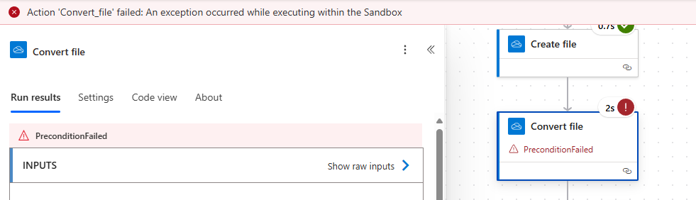

It seems there is a file size limit, that Microsoft _conveniently_ forgot to add to their documentation 🤦. I found this out by endless searching and experimentation. **The limit is most likely 2 MB.**

So what now? Well, we're going to **really** do it ourselves 🧑‍🔧.

## Custom code solution

:::info Prerequisites  
For this you'll need at least these:

-   Azure subscription
-   Python installed on your system
-   [Azure Function Core Tools](https://learn.microsoft.com/en-us/azure/azure-functions/functions-run-local?tabs=windows%2Cisolated-process%2Cnode-v4%2Cpython-v2%2Chttp-trigger%2Ccontainer-apps&pivots=programming-language-csharp) installed on your system
-   [Azure CLI](https://learn.microsoft.com/en-us/cli/azure/what-is-azure-cli?view=azure-cli-latest) installed on your system
-   A resource group in Azure
-   Basic understanding of containerized applications

You're welcome to follow along without deep knowledge of these topics. This post wont go into system setup at all.

:::
The plan is to create some magical piece of Python code that will do the conversion for us from email to PDF. The email is going to be passed to the service as .eml as it is with Encodian.

The absolute hardest part with this was to find a library to help with the conversion. Many I found were dependant on [wkhtmltopdf](https://github.com/wkhtmltopdf/wkhtmltopdf), which has been archived for a couple of years now. It's not a good idea to use a package that will _not_ receive any updates. After **a lot** of searching I landed on using Pythons own [email handling package](https://docs.python.org/3/library/email.html#module-email) for extracting the HTML. Then we'll use [Playwright](https://playwright.dev/python/) for rendering that into a PDF.

### Azure Function

The platform of my choosing is [Azure Functions](https://learn.microsoft.com/en-us/azure/azure-functions/functions-overview). It is an awesome serverless compute service from Microsoft that let us run small (or large) pieces of code without having to manage infrastructure. Functions are also a very cost effective option for this kind of workload.

#### Converting .eml to .pdf with Python

:::info
I'll log quite a bit of things into the console in this example. In the [finalized version](https://github.com/miberr/Azure-Function-Convert-EML-to-PDF) I've removed some of the development time logging.
:::

So here's the plan: we need a Function that receives the file and returns the converted PDF. The file will be passed as base64 encoded string inside of a JSON body. Another option would be to use multi-part, but frankly, I don't understand enough of it to pass it from Power Automate / Logic Apps onward.

Our POST requests body would look something like this:

```json
{ "file": "UmVjZWl2ZWQ6IGZyb20gVkkwUDE5MU1CMjY3OS5FVVJQMTkxLlBST0Q..." }
```

Let's start coding 🤓.

1. [Create a project](https://learn.microsoft.com/en-us/azure/azure-functions/create-first-function-vs-code-python) in Visual Studio Code. This will generate some boilerplate code for us to easily start creating some logic

1. Substitute the generated function definition with this:

    ```python title="function_app.py"
    @app.route(route="convertEmlToPdf", methods=["POST"])
    def convertEmlToPdf(req: func.HttpRequest) -> func.HttpResponse:

        logging.info('Processing request...')

        try:
            req_body = req.get_json()
            file_content_base64 = req_body.get('file')

            # If no file is provided, return an error
            if file_content_base64:

                # REST OF OUR CODE HERE

                # Temporary return for testing purposes
                return func.HttpResponse("All good.", status_code=200)
            else:
                return func.HttpResponse("No file found in request body.", status_code=400)

        except Exception as e:

            logging.error(f"Error processing request: {e}")

            return func.HttpResponse(f"Error processing request: {e}", status_code=400)

    ```

1. Install packages and start the Function App in the terminal

    ```bash
    pip install -r requirements.txt
    func start
    ```

1. Send a POST request to the function

    ```http
    POST http://localhost:7071/api/convertEmlToPdf

    {
        "file": "UmVjZWl2ZWQ6IGZyb20gVkkwUDE5MU1CMjY3OS5FVVJQMTkxLlBST0Q..."
    }
    ```

    - Use [Postman](https://www.postman.com/) or similar tool to send POST requests
    - Get an exported email for testing. You can export from Outlook by clicking a message with right mouse button and selecting **Save as => Save as EML**
    - Convert the file to base64 string with a tool like [base64encode.org](https://www.base64encode.org/)

1. You should get a **200** response

##### .eml to HTML

Now that we've got ourselves a working function, let's implement parsing the file 🖨️.

1. Add the highlighted code to your function. Don't forget the imports!

    ```python title="function_app.py"
    import azure.functions as func
    import logging
    # highlight-start
    import base64
    from email import policy
    from email.parser import BytesParser
    # highlight-end

    app = func.FunctionApp(http_auth_level=func.AuthLevel.FUNCTION)

    @app.route(route="convertEmlToPdf", methods=["POST"])
    def convertEmlToPdf(req: func.HttpRequest) -> func.HttpResponse:

        logging.info('Processing request...')

        try:
            req_body = req.get_json()
            file_content_base64 = req_body.get('file')

            # If no file is provided, return an error
            if file_content_base64:

                # highlight-start
                # Decode the base64 encoded file content
                logging.info("File content received, decoding...")
                file_content = base64.b64decode(file_content_base64)

                # Parse the EML file content
                logging.info("Parsing EML file content...")
                msg = BytesParser(policy=policy.default).parsebytes(file_content)

                # Log information about the email to the console
                logging.info("Extracting email information...")
                logging.info(f"Subject: {msg['subject']}")
                logging.info(f"From: {msg['from']}")
                logging.info(f"To: {msg['to']}")
                logging.info(f"CC: {msg['cc']}")
                logging.info(f"Date: {msg['date']}")
                # highlight-end

                # REST OF OUR CODE HERE

                return func.HttpResponse("All good.", status_code=200)

            else:
                return func.HttpResponse("No file found in request body.", status_code=400)

        except Exception as e:

            logging.error(f"Error processing request: {e}")

            return func.HttpResponse(f"Error processing request: {e}", status_code=400)
    ```

1. Send a test request. There is no need to reload the function worker in the terminal, it uses hot reload for our convenience. You should see the basic information about the email printed on the console

    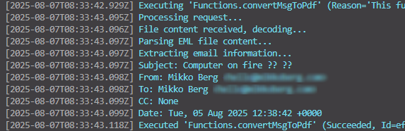

    Now we'll tackle the HTML part of this thing. We'll install [BeautifulSoup](https://www.crummy.com/software/BeautifulSoup/bs4/doc/) that lets us mutate the HTML easily. It's necessary to mess with the HTML because we want to show the metadata _(sender, date etc.)_ of the email before the body.

1. Add the highlighted code to your requirements.txt

    ```txt title="requirements.txt"
    # DO NOT include azure-functions-worker in this file
    # The Python Worker is managed by Azure Functions platform
    # Manually managing azure-functions-worker may cause unexpected issues

    azure-functions
    # highlight-start
    beautifulsoup4
    # highlight-end
    ```

1. Add the highlighted code to your function. This will extract the HTML, create header elements and return the HTML document for us. Make sure you replace the return statement in the function and also add the imports

    ```python title="function_app.py"
    import azure.functions as func
    import logging
    import base64
    # highlight-start
    import html
    from bs4 import BeautifulSoup
    # highlight-end
    from email import policy
    from email.parser import BytesParser

    app = func.FunctionApp(http_auth_level=func.AuthLevel.FUNCTION)

    @app.route(route="convertEmlToPdf", methods=["POST"])
    def convertEmlToPdf(req: func.HttpRequest) -> func.HttpResponse:

        logging.info('Processing request...')

        try:
            req_body = req.get_json()
            file_content_base64 = req_body.get('file')

            # If no file is provided, return an error
            if file_content_base64:

                # Decode the base64 encoded file content
                logging.info("File content received, decoding...")
                file_content = base64.b64decode(file_content_base64)

                # Parse the EML file content
                logging.info("Parsing EML file content...")
                msg = BytesParser(policy=policy.default).parsebytes(file_content)

                # Log information about the email to the console
                logging.info("Extracting email information...")
                logging.info(f"Subject: {msg['subject']}")
                logging.info(f"From: {msg['from']}")
                logging.info(f"To: {msg['to']}")
                logging.info(f"CC: {msg['cc']}")
                logging.info(f"Date: {msg['date']}")

                # highlight-start
                # Get the body of the email
                logging.info("Extracting email body...")
                msg_body = msg.get_body(preferencelist=('html', 'plain'))

                # Make soup object from the email body
                soup = BeautifulSoup(msg_body.get_content(), 'html.parser')

                # Create a header with email metadata
                logging.info("Creating header with email metadata...")
                header = '<div>'
                header += f'<b>Date:</b> {html.escape(msg["date"])}<br>'
                header += f'<b>Subject:</b> {html.escape(msg["subject"])}<br>'
                header += f'<b>From:</b> {html.escape(msg["from"])}<br>'
                header += f'<b>To:</b> {html.escape(msg["to"])}<br>'
                # If CC is present, add it to the header
                if msg["cc"]:
                    header += f'<b>CC:</b> {html.escape(msg["cc"])}<br>'

                # ATTACHMENTS HANDLING HERE

                header += '<hr><br></div>'
                headerFragment = BeautifulSoup(header, 'html.parser')

                # Insert the header at the beginning of the body
                soup.body.insert_before(headerFragment)

                # Insert styling to the HTML
                soup.head.insert_before(BeautifulSoup('<style>@media print { img {max-width: 100% !important; max-height: 100% !important; } }</style>', 'html.parser'))

                # REST OF OUR CODE HERE

                # Temporary return for testing purposes
                return func.HttpResponse(soup.prettify(), mimetype="text/html", status_code=200)
                # highlight-end
            else:
                return func.HttpResponse("No file found in request body.", status_code=400)

        except Exception as e:

            logging.error(f"Error processing request: {e}")

            return func.HttpResponse(f"Error processing request: {e}", status_code=400)
    ```

1. In the terminal, terminate the function worker by clicking **CTRL + C**, if you have the function running
1. Run the installation of packages again and then start the Function App
    ```bash
    pip install -r requirements.txt
    func start
    ```
1. Send a test request. You should get the HTML as response. As you can see, we don't have the inline images

    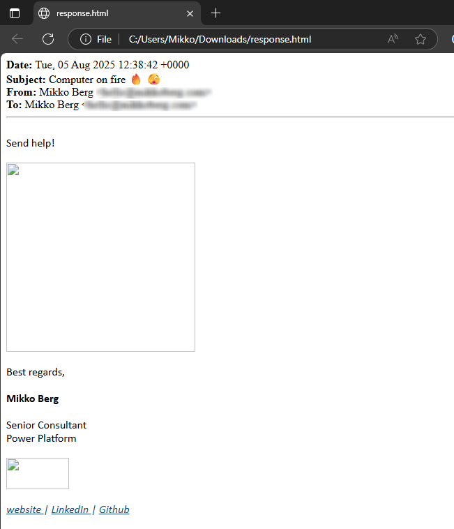

1. Let's add that code in. Add the code in place of comment _ATTACHMENTS HANDLING HERE_

    ```python title="function_app.py" showLineNumbers=57
    headerAttachments = ''

    # Iterate through the email parts to find attachments and inline images
    logging.info("Processing email parts for attachments and inline images...")
    for part in msg.walk():
        # For attachments add filename to headerAttachments
        if part.get_content_disposition() == 'attachment':

            headerAttachments += f'<li>{html.escape(part.get_filename())}</li>'
            logging.info(f"Found an attachment: {part.get_filename()}")
        # For inline images, replace the src with base64 data
        if part.get_content_disposition() == 'inline':
            logging.info(f"Found an inline part: {part.get_filename()}")
            logging.info(f"Content-Id: {part.get('Content-Id')[1:-1] }")

            # Find the image tag in the soup object
            imgTag = soup.find(src='cid:'+part.get('Content-Id')[1:-1])

            # If the image tag is found, replace the src with base64 data
            if imgTag:
                logging.info(f"Image tag found: {imgTag}")
                imgTag['src'] = 'data:' + part.get_content_type() + ';base64,' + base64.b64encode(part.get_payload(decode=True)).decode('utf-8')
                logging.info(f"Image data embedded.")

    if headerAttachments:
        header += '<b>Attachments:</b><ul>'
        header += headerAttachments
        header += '</ul>'
    ```

1. Send a test request. Now we have our inline images 😎!

    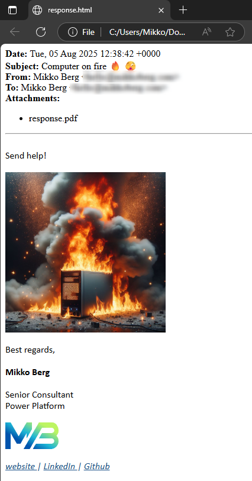

##### HTML to .pdf

Getting to the HTML was **not** a walk in the park 🚶 but that was nothing compared to the conversion from HTML to PDF. For whatever reason nothing seemed to work and I was ready to give up. However, I finally found a solution from an unlikely source - using a testing framework. It handles all the heavy lifting of rendering HTML and saving to PDF with a simple API.

1. Add the highlighted code to your requirements.txt

    ```txt title="requirements.txt"
    # DO NOT include azure-functions-worker in this file
    # The Python Worker is managed by Azure Functions platform
    # Manually managing azure-functions-worker may cause unexpected issues

    azure-functions
    beautifulsoup4
    # highlight-start
    playwright
    # highlight-end
    ```

1. In the terminal, terminate the function worker by clicking **CTRL + C**, if you have the function running
1. Run the installation of packages again, install Playwright browsers and then start the Function App
    ```bash
    pip install -r requirements.txt
    playwright install
    func start
    ```
1. In the **function_app.py**, import Playwright and mark the function as async

    ```python title="function_app.py" showLineNumbers
    import azure.functions as func
    import logging
    import base64
    import html
    from email import policy
    from email.parser import BytesParser
    from bs4 import BeautifulSoup
    # highlight-next-line
    from playwright.async_api import async_playwright

    app = func.FunctionApp(http_auth_level=func.AuthLevel.FUNCTION)

    @app.route(route="convertEmlToPdf", methods=["POST"])
    # highlight-next-line
    async def convertEmlToPdf(req: func.HttpRequest) -> func.HttpResponse:
        logging.info('Processing request...')
    ```

1. Add the rest of the function code in place of the comment **REST OF OUR CODE HERE**. Replace the testing return statement as well

    ```python title="function_app.py" showLineNumbers=95
    # Convert the modified HTML to PDF
    logging.info("Converting HTML to PDF...")
    async with async_playwright() as p:
        # Launch a headless browser and create a new page
        browser = await p.chromium.launch(headless=True)
        page = await browser.new_page()
        # Set the content of the page to the extracted and modified HTML
        await page.set_content(str(soup.prettify(formatter="html")))
        # Generate the PDF from the page content in A4 format
        pdf = await page.pdf(format='A4', print_background=True)
        # Close the browser
        await browser.close()
        logging.info("PDF conversion completed.")

    return func.HttpResponse(
        pdf,
        mimetype="application/pdf",
        status_code=200
    )
    ```

1. Send a test request. Now we have the PDF 💃

    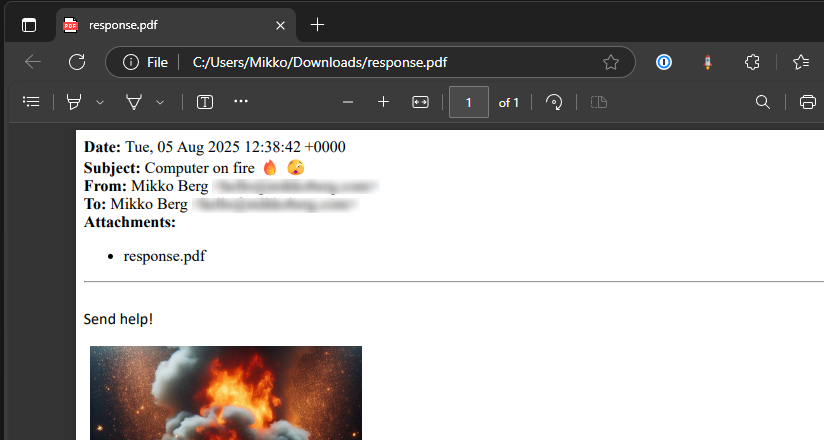

### Containerized Azure Function

Next hurdle is that we can't host this function in normal Azure Functions. This is because we need to install a browser for HTML to PDF rendering. The answer here is to convert the function to a [Containerized Function](https://learn.microsoft.com/en-us/azure/azure-functions/functions-how-to-custom-container?tabs=core-tools%2Cacr%2Cazure-cli2%2Cazure-cli&pivots=container-apps). Hosting a containerized Function App can be done with multiple Azure services: Azure Container Apps, Azure Functions (premium) or Azure Arc (preview). I will be using Azure Container Apps for this case.

Converting existing Function App into a containerized Function App can be done simply with running `func init --docker-only` in the terminal. This creates a **Dockerfile** that controls the creation of the container.

1. Add the highlighted rows into the **Dockerfile**

```dockerfile title="Dockerfile" {13-15}
# To enable ssh & remote debugging on app service change the base image to the one below
# FROM mcr.microsoft.com/azure-functions/python:4-python3.9-appservice
FROM mcr.microsoft.com/azure-functions/python:4-python3.9

ENV AzureWebJobsScriptRoot=/home/site/wwwroot \
    AzureFunctionsJobHost__Logging__Console__IsEnabled=true

COPY requirements.txt /
RUN pip install -r /requirements.txt

COPY . /home/site/wwwroot

# Install Playwright browsers
RUN playwright install chromium
RUN playwright install-deps
```

That's it! In this blog post I'm not going trough the whole process of building the container, pushing it to a registry and so on. You are welcome to use my pre-built container and deploy resources with supplied Bicep file. Instructions for this can be found in [GitHub](https://github.com/miberr/Azure-Function-Convert-EML-to-PDF).

Next, I'll give you an overview of the infrastructure we need in Azure.

### Infrastructure

This project needs quite a few resources. In the table below ⬇️ you get an overview of all of the components being deployed with the [💪 Bicep file](https://raw.githubusercontent.com/miberr/Azure-Function-Convert-EML-to-PDF/main/infrastructure.bicep) I've prepared for you.

| Component                                                                                                                          | Purpose                                                                                                |
| :--------------------------------------------------------------------------------------------------------------------------------- | :----------------------------------------------------------------------------------------------------- |
| [Application Insights](https://learn.microsoft.com/en-us/azure/azure-monitor/visualize/insights-overview)                          | Visualization of telemetry                                                                             |
| [Connection](https://learn.microsoft.com/en-us/azure/connectors/introduction#connection-creation-configuration-and-authentication) | Three connections for Logic Apps to access Outlook, OneDrive and Key Vault                             |
| [Container App](https://learn.microsoft.com/en-us/azure/container-apps/overview)                                                   | Hosting for our Function App                                                                           |
| [Container App Environment](https://learn.microsoft.com/en-us/azure/container-apps/environment)                                    | Providing environment for Container Apps to run on                                                     |
| [Diagnostic Setting](https://learn.microsoft.com/en-us/azure/azure-monitor/platform/diagnostic-settings?tabs=portal)               | Setting to export telemetry from Logic Apps to Log Analytics Workspaces                                |
| [Key Vault](https://learn.microsoft.com/en-us/azure/key-vault/general/overview)                                                    | Facilitates secure access to Function App with API keys without having to store the keys in Logic Apps |
| [Log Analytics Workspace](https://learn.microsoft.com/en-us/azure/azure-monitor/logs/log-analytics-workspace-overview)             | Place for capturing telemetry from various components                                                  |
| [Logic Apps](https://learn.microsoft.com/en-us/azure/logic-apps/logic-apps-overview)                                               | Workflow for exporting emails, sending to the function and storing the PDF                             |
| [Storage Account](https://learn.microsoft.com/en-us/azure/storage/common/storage-account-create?tabs=azure-portal)                 | Functions need storage accounts to work, no other purpose in this use case                             |

For communication between the components, [managed identities](https://learn.microsoft.com/en-us/entra/identity/managed-identities-azure-resources/overview) are my tool of choice. Managed identity is an authentication mechanism between machines which replaces the need for using secrets. There's a couple of permissions needed as well:

| Role                                                                                                                                                    | Scope                | Managed Identity |
| :------------------------------------------------------------------------------------------------------------------------------------------------------ | :------------------- | :--------------- |
| [Key Vault Administrator](https://learn.microsoft.com/en-us/azure/role-based-access-control/built-in-roles/security#key-vault-administrator)            | Key Vault            | Container App    |
| [Key Vault Secrets User](https://learn.microsoft.com/en-us/azure/role-based-access-control/built-in-roles/security#key-vault-secrets-user)              | Key Vault            | Logic Apps       |
| [Monitoring Metrics Publisher](https://learn.microsoft.com/en-us/azure/role-based-access-control/built-in-roles/monitor#monitoring-metrics-publisher)   | Application Insights | Container App    |
| [Storage Blob Data Contributor](https://learn.microsoft.com/en-us/azure/role-based-access-control/built-in-roles/storage#storage-blob-data-contributor) | Storage Account      | Container App    |

### Pulling it all together with a Logic App

If you choose to deploy the resources with the [💪 Bicep file](https://raw.githubusercontent.com/miberr/Azure-Function-Convert-EML-to-PDF/main/infrastructure.bicep) you'll have the completed Logic App as well. I wanted for you to be able to get up and running swiftly, so I chose Logic Apps instead of Power Automate. In addition, Power Automate can't use the managed identities, so there would be more configuration work to be done.

With that background knowledge out of the way, let's check out the Logic App!

1. The workflow is triggered by email arriving to Outlook inbox

    :::warning
    If you deployed my version, there is no filter in the trigger. Maybe you want all emails converted, but if not, add a filter manually or use a trigger of your choice.
    :::

1. Export the email with **Export Email** action

    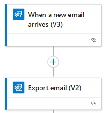

1. **Get secret** action from **Key Vault** connector. This is needed to access the API key generated by our function

    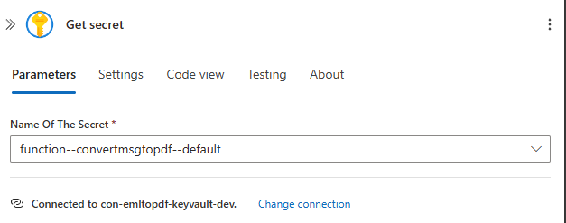

    :::info
    We wrote our function to be secured with a function key. Anonymous would also work, but remember that our container is accessible via the internet. It is an excellent idea to secure our endpoints.
    :::

1. Now we can make the request to our endpoint. Note that the **API key** is passed with a **x-functions-key** header. The body is a JSON object with the email export encoded as base64. The expression is: `base64(body('Export_email_(V2)'))`.

1. Save the response into **OneDrive** with email + ticks being the name of the file.

    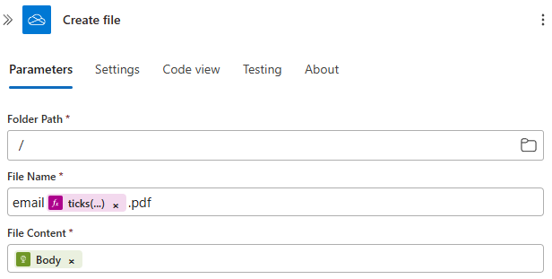

    :::info
    Ticks give us an integer counting every 100 nanoseconds starting with 1st of January 0001 00:00:00. With quite a good confidence the resulting filenames are going to be unique. If you have heavy traffic with multiple instances working, use GUIDs instead. For most applications ticks are sufficient to avoid duplicate file names.
    :::

### Deploy

The very last thing to do is to deploy all we've talked about to Azure. For this you'll need [Azure CLI](https://learn.microsoft.com/en-us/cli/azure/what-is-azure-cli?view=azure-cli-latest) as well as the [💪 Bicep file](https://raw.githubusercontent.com/miberr/Azure-Function-Convert-EML-to-PDF/main/infrastructure.bicep) I've prepared for you. This template uses a container built by me hosted at the [repository](https://github.com/miberr/Azure-Function-Convert-EML-to-PDF).

1.  Open terminal
1.  Login to Azure CLI with command `az login`. A popup opens, login with your credentials
1.  If you have multiple subscriptions, select the one you want to deploy to by typing its number and pressing **enter**

    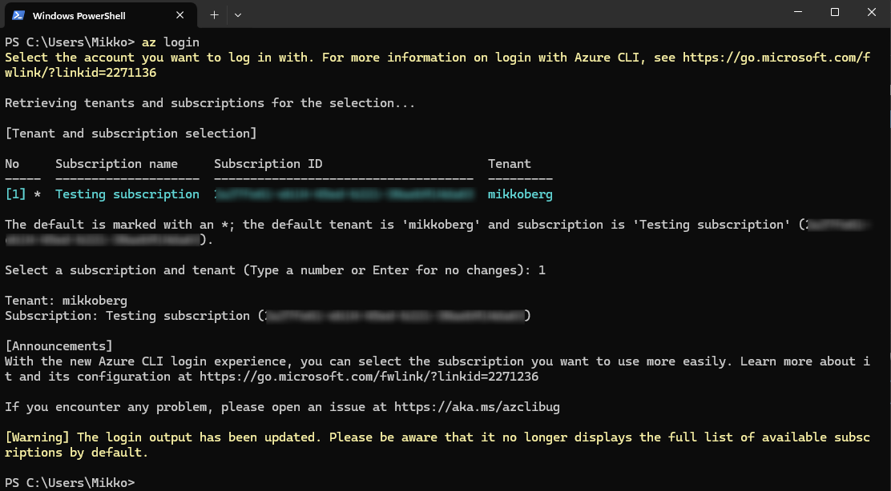

1.  Next we'll deploy. Run command `az deployment group create --template-file .\infrastructure.bicep --resource-group rg-emailtopdftest-dev --parameters environment=dev appName=emailtopdftest` with the following parameters:

    -   _infrastructure.bicep_ is the template filename
    -   _rg-emailtopdftest-dev_ the resource group name
    -   _dev_ is the environment, either dev or prod accepted
    -   _emailtopdfTest_ is the app name, this needs to be unique

    In case there is a conflict with a name for example, the CLI will notify you about it. If you see no red, that means the deployment was successful 🥳.

1.  Navigate to your resource group in Azure Portal. It should now look like this:

    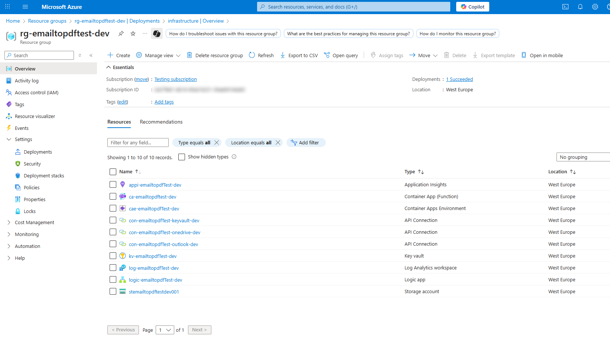

1.  To initialize the secrets in **Key Vault** we have to send a POST request to the new endpoint

    -   Find the url by navigating to the **Container App**
    -   Copy the value

        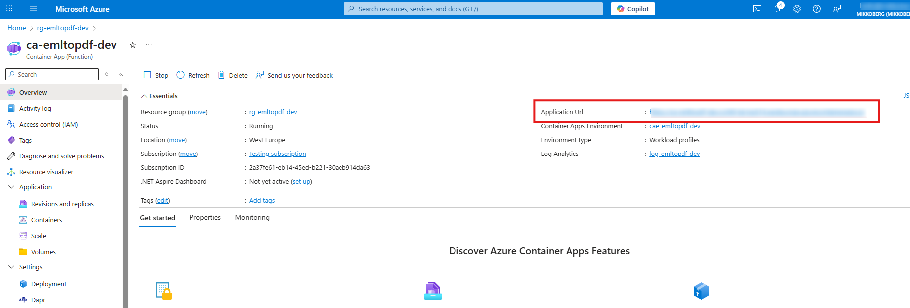

    -   Add `/api/convertEmlToPdf` to the end of the URL
    -   Send a request with your chosen tool. Make sure you include the **x-functions-key** header. The value can be anything, for example `test`. You should get **401 Unauthorized** response back

        ```http
        POST https://xxxx.westeurope.azurecontainerapps.io/api/convertEmlToPdf
        x-functions-key: test

        {
            "file": "UmVjZWl2ZWQ6IGZyb20gVkkwUDE5MU1..."
        }
        ```

1.  The last configuration for us to do is to open the API connections for Outlook and OneDrive and authorize them. Click on the **first one**

    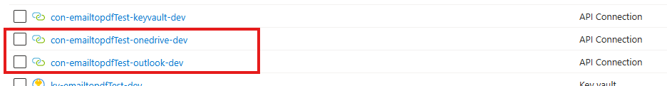

1.  Click on the **error**, then **Authorize**, login with your account and finally select **Save**

    :::warning
    You should use the account you want to connect to Outlook or OneDrive with. It's best practice to use service accounts for these kind of scenarios.
    :::
    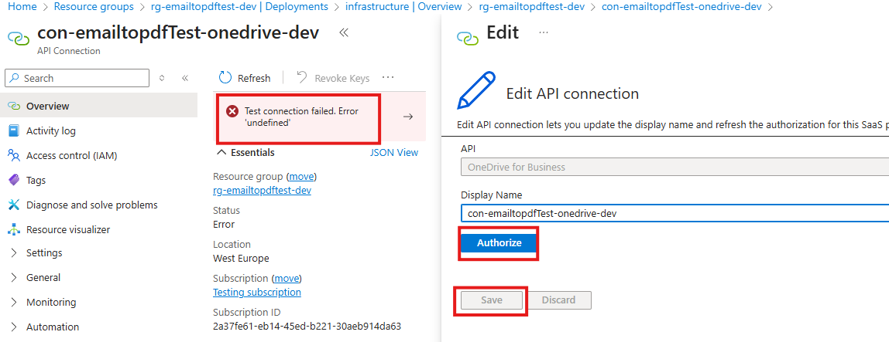

1.  Repeat for the other connection

1.  Now send an email to the inbox you connected to and wait for the file to appear in OneDrive

## Conclusion

Woof 🐶 that was hard... Luckily now all the grunt work is done and the solution can be reused time and time again.

Automating the conversion of emails to PDFs can save significant time and streamline workflows. In this post, we explored two approaches — from using third-party connector Encodian Flowr to building a fully custom solution with Azure Functions, Python, and Playwright. We also covered the necessary Azure infrastructure and deployment steps, ensuring a secure and scalable setup.

Whether you opt for a ready-made connector or a custom containerized function, you now have a clear path to implement email-to-PDF automation in your environment. If you want to get started quickly, check out the [GitHub repository and Bicep templates](https://github.com/miberr/Azure-Function-Convert-EML-to-PDF). Thank you 🙏 for getting this far and happy automating 🤖!
