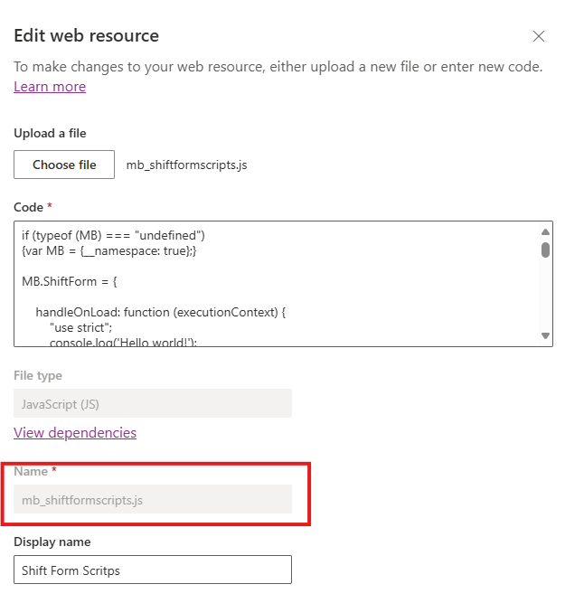
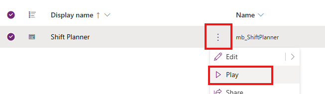
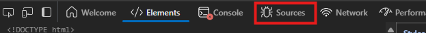

Development of client side scripting can be painfull. As discussed in my [previous blog post](../02-12-must-know-javascript-in-model-driven-apps/index.md) it is very easy to get started, but the flow of coding ➡️ uploading ➡️ publishing ➡️ refresing is time consuming and annoying.

Microsoft describes [how to use Fiddler](https://learn.microsoft.com/en-us/power-apps/developer/model-driven-apps/streamline-javascript-development-fiddler-autoresponder) to help with this issue. As a Mac user, issue is that Fiddler Classic is not available for MacOS. [Fiddler Ewerywhere](https://www.telerik.com/fiddler/fiddler-everywhere) is, but it's not free. We can do development without any additional installations - browser developer tools 🌟. Let's next discuss on how to streamline your development flow with them!

<!-- truncate -->

## Browser developer tools

Browser developer tools are a set of built-in utilities in modern web browsers that help developers inspect and debug web pages. They provide features like HTML and CSS inspection, JavaScript debugging, network activity monitoring, and performance analysis, making it easier to develop and troubleshoot web applications. 

very modern browser has developer tools build in. They might be called a bit differently, but the functionality is generally the same. They are an essential tool in your Power Platform toolbox. I'll use Microsoft Edge in the examples, but Google Chrome works pretty much the same. Here we'll dive into JavaScript debugging.

## Let's inspect 🕵️

### Get the name of the Web Resource

I'm going to use my previous example about Client Scripting. To start, you need to find the logical name of your web resource you want to continue to develop. 

1. Go to your solution with the app and web resource
1. Open the edit panel of the web resource
1. Copy the **Name** property
    

### Override the resource in Developer tools

:::info

I'm, using Microsoft Edge, but Google Chrome and others work very similarly.

:::

To enable us to continuosly develop and test our code, we need to override the web resource in the browser.

1. Play your model-driven Power App
    
1. Navigate tho the form where you use JavaScript
1. Press **F12** on your keybord. Developer tools open next to the webpage.
1. Select **Sources**.
    
1. 
